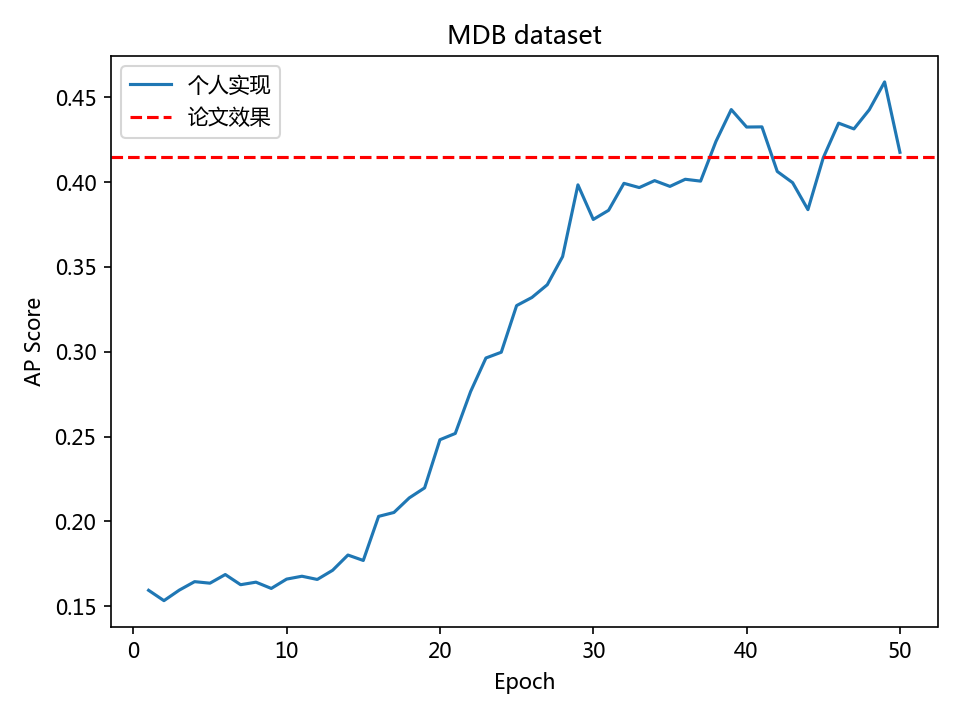

# 本项目打算复现 论文TopoMAD

> 论文标题 | A Spatiotemporal Deep Learning Approach for Unsupervised Anomaly Detection in Cloud Systems  
> 论文来源 | TNNLS (B) 2020  
> 数据链接 | https://github.com/QAZASDEDC/TopoMAD  

本项目并应该算是基本复现出了论文的效果，论文在MDB数据集中，AP值达到了41.5，也能达到40+。

MDB数据集复现效果图:

MDB数据集上的复现代码为： torch-topomad-MDB.ipynb 文件

MDB数据集上的LOF,OCSVM的对比实现的代码为： cmp-MDB.ipynb 文件

项目Kaggle代码: https://www.kaggle.com/qq2471001205/torch-topomad

# 参考文献
1. https://dreamhomes.top/posts/202103111131.html
2. https://zhuanlan.zhihu.com/p/304871417
